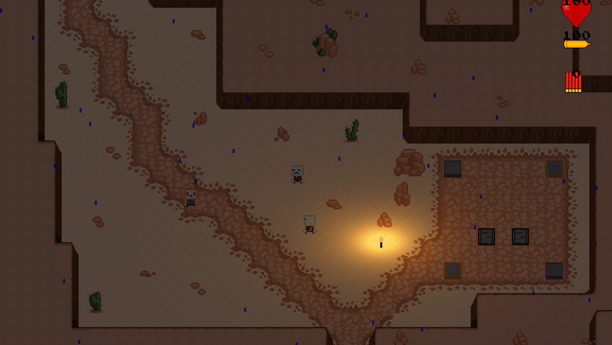
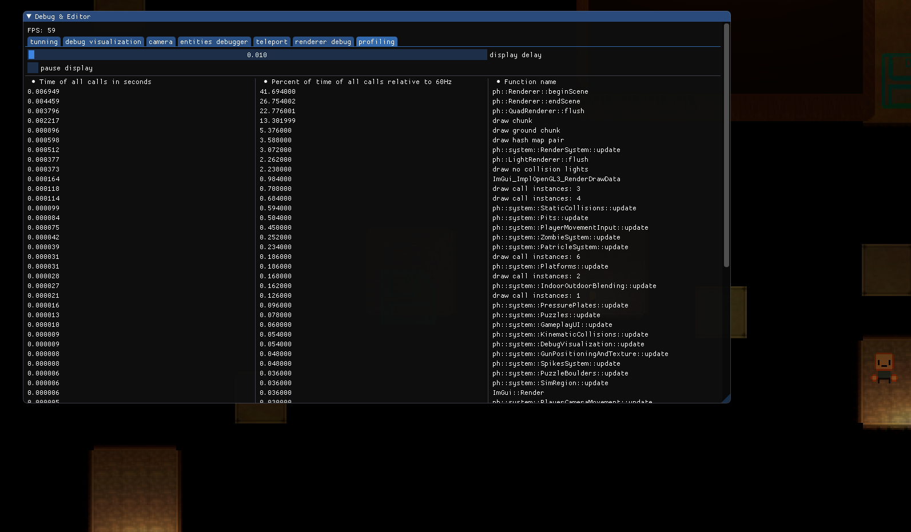
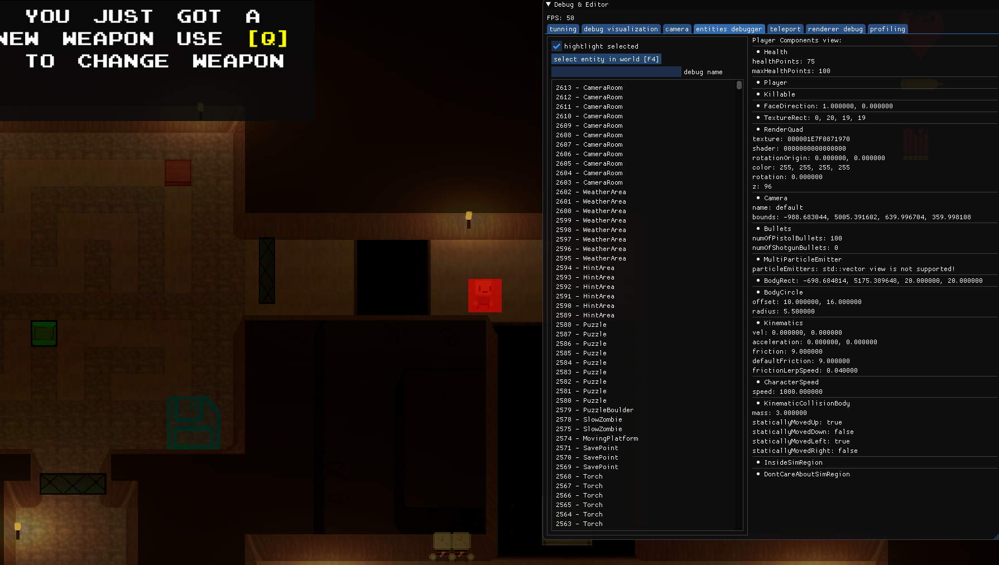

### 2D, Zombie, RPG game made from scratch in C++

## Download:
Gamejolt: https://gamejolt.com/games/somepolishcoders/440031 
itch io: https://somepolishcoders.itch.io/pophead

## Project was officially abandonned in summer 2020

## Compiling PopHead:
You can generate the project files using premake. Check out the tutorial:  
https://github.com/SPC-Some-Polish-Coders/PopHead/blob/master/docs/forProgrammers/projectGeneratingTutorial.md

## 3rd party libraries used in our project:
-  EnTT: https://github.com/skypjack/entt/
-  SFML: https://github.com/SFML/SFML
-  GLEW: https://github.com/nigels-com/glew
-  stb_image & stb_truetype: https://github.com/nothings/stb
-  Catch2: https://github.com/catchorg/Catch2

## Screenshots:

## Credits:
#### project lead: 
Grzegorz "Czapa" Bednorz

#### programmers:
- Grzegorz "Czapa" Bednorz
- Piotr Gardocki
- Szymon "Whittler" Strugała
- Hubert Misiewicz
- Kamil Lewan
- Kamil "Sajko"
- Adam "Bobem" Żukowski
- Mirrális Dias Santana
- Lorwin "Graphffiti"
- Piotek "Fave"
- "Thief"

#### game / level designer:
- Grzegorz "Czapa" Bednorz
- Piotr "Prezes" Brzostowski
- Stephen Smith
- Adrian Paulus

#### music and sound creator:
- Jerzy Wujczyk
- Mateusz Stepka

#### graphics creators:
- Andrzej "Jumbocube" Brol
- "SiwyKleszcz"

#### quality assurance:
- "Pavko"
- Piotr Wielgórski
- "Siwy Kleszcz"

#### marketing:
- Adrian Paulus

