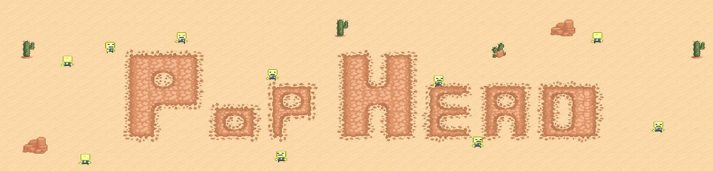
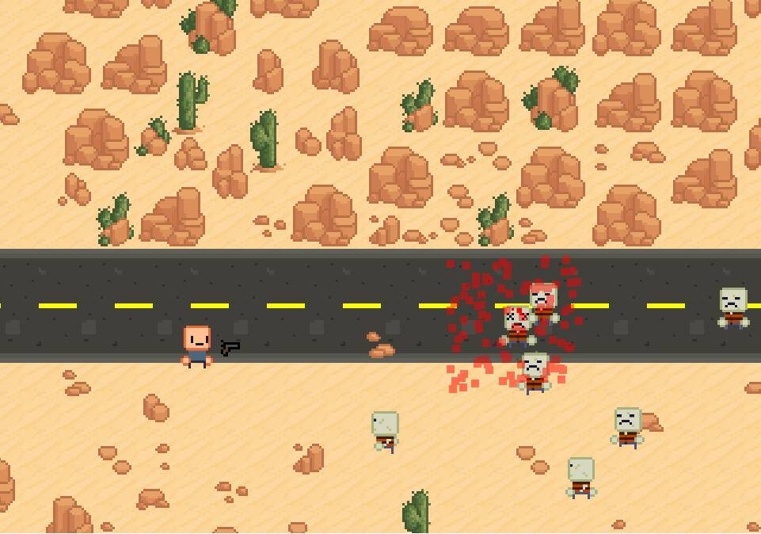
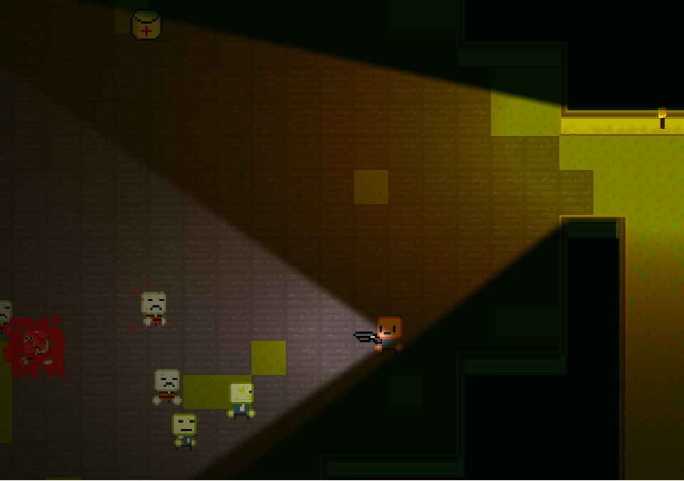
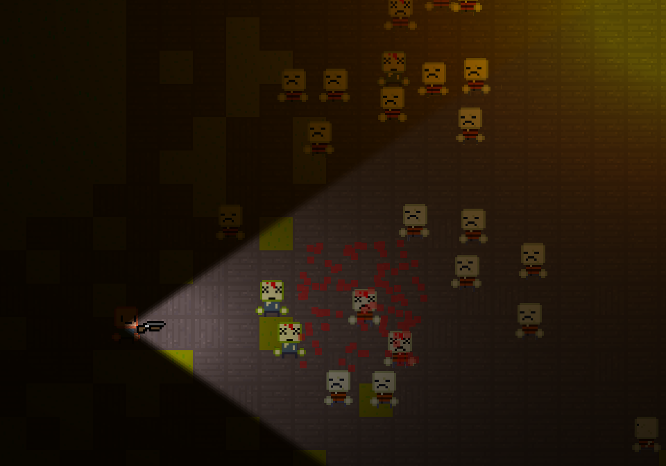

### PopHead is an 2D action RPG game with zombie, which is being made on our own engine. The engine is being written in C++.

## Download:
Gamejolt: https://gamejolt.com/games/somepolishcoders/440031 
itch io: https://somepolishcoders.itch.io/pophead

## Recrutation:
We're currently looking for: 
C++ programmers, Graphics designers, Music creators, Game designers, Quest desigers, Level designers.  
For more information click [HERE](docs/recrutation.md)

## Contact:
To contact us just join our discord server or send an email.   
Discord: https://discord.gg/mxmQhNm  
Email: somepolishcoders@aol.com

## Compiling PopHead:
You can generate the project files using premake our scripts. Check out the tutorial:  
https://github.com/SPC-Some-Polish-Coders/PopHead/blob/master/docs/forProgrammers/projectGeneratingTutorial.md

## 3rd party libraries used in our project:
-  SFML: https://github.com/SFML/SFML
-  Catch2: https://github.com/catchorg/Catch2

## Screenshots:

