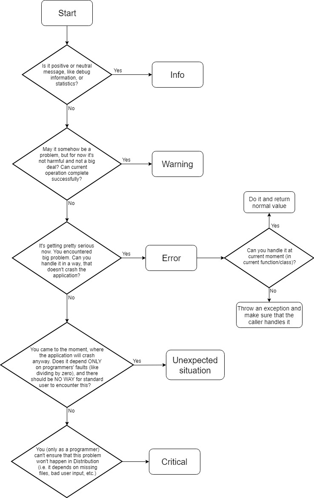

# Logging Tutorial

### Log Levels
- Info
- Warning
- Error
- Critical

### Logging macros

Basic macros:
- PH_LOG_INFO(message);
- PH_LOG_WARNING(message);
- PH_LOG_ERROR(message);
- PH_LOG_CRITICAL(message);

They are used to report a log of corresponding level to global Log system. PH_LOG_INFO and PH_LOG_WARNING are turned off in Distribution version of application for optimazation purposes. PH_LOG_CRITICAL is the only one of them that throws an exception of type ph::CriticalError. The more precise description of logging levels can be found below.

Assert macros:
- PH_ASSERT_WARNING(expression, message);
- PH_ASSERT_ERROR(expression, message);
- PH_ASSERT_CRITICAL(expression, message);

These are declared only for convenience. They check an expression and when it's expanding to false, then they report a log with corresponding level.

Additional macros:
- PH_UNEXPECTED_SITUATION(message);
- PH_ASSERT_UNEXPECTED_SITUATION(expression, message);

PH_UNEXPECTED_SITUATION is a very important macro. It works just like PH_LOG_CRITICAL (both are on Critical Log level), but PH_UNEXPECTED_SITUATION is not compiled in Distribution. That means, that these errors will not be officially handled, but they'll probably crash the application. It's not easy to find good use cases for this macro in code, so if you're not sure which one you need, just choose PH_LOG_CRITICAL. This macro can be used only in situations, that you're absolutely sure won't happen in Distribution. But assumptions can be made only from code's point of view.

Things you CANNOT ensure:
- You can't assume that files exist and they're not broken.
- You can't assume that input given by users is valid (But you can assume that after accurate validation).

Things you CAN ensure as a programmer:
- When you have function, that divides something by given variable, you can check if ALL of the callings of that function can't give it value 0.
- In class ResourceHolder there are methods to load and get a resource. You can ensure, that after failed loading no one will try to get the resource that doesn't exist (You can either end the application or create some default resource, like default texture).

Deprecated macros:
- PH_ASSERT(expression, message);
- PH_EXCEPTION(message);
- PH_ASSERT_EXCEPTION(expression, message);

These macros were created in first version of debug/log system. Now they are replaced with logging macros described above. They will be eventually removed both from code and documentation.

#### Important note about using macros

Avoid using macros in if statements or loops without curly brackets. Due to how macros in C++ work, that may cause compiler errors.

Example:
```cpp
if (condition)
    PH_LOG_WARNING("message"); // don't do that

if (condition) {
    PH_LOG_WARNING("message"); // that's fine
}
```

## Precise description and use cases of logging levels
- Info - tells that an operation succeeded, or gives debug informations (e.g. statistics). Can only be used with positive messages (not errors or problems). It must contain enough informations to distinctly identify an operation, but not everything, like whole content of file.
	
    Bad use cases:
	```cpp
    Xml Xml::getChild(std::string name) const {
        // ...
        PH_LOG_INFO("Xml getChild(): " + xml.mContent);  
        // content of Xml is to large, we litter the logs
        // ...
    }
    
    bool Xml::hasAttribute(std::string name) const {
        // ...
        PH_LOG_INFO("Xml hasAttribute(): false");
        // absolutely useless, doesn't give any information, maybe write tag's and attibute's names?
        // ...
    }
    ```
	Good use cases:
	```cpp
    void Entity::addChild(std::unique_ptr<Entity> newChild) {
        // ...
        PH_LOG_INFO("Entity \"" + nameOfNewChild + "\" was added as child of the \"" + mName + "\"");
        // we can identify what was added, and where
    }

    void CollisionDebugSettings::turnOn() {
        mShouldDisplay = true;
        PH_LOG_INFO("Collision debug was turned on.");
        // in this context it is enough information
    }
    
    int main() {
        PH_LOG_INFO("start initializing PopHead");
        ph::Game game;
        PH_LOG_INFO("start executing PopHead");
        game.run();
        // that's ok, we seperate the sections of Logs for readability
    }
    ```

- Warning - tells about situation, that might be a problem, but is not harmful for now. These situations should be very easily handled, or even ignored.
	
    Bad use cases:
	```cpp
    template< typename ResourceType >
    auto ph::ResourceHolder<ResourceType>::get(const std::string& filePath) -> ResourceType & {
        std::string fullFilePath = "resources/" + filePath;
        auto found = mResources.find(fullFilePath);
        if (found == mResources.end()) {
            // that problem is serious, there should be PH_LOG_ERROR, or even PH_LOG_CRITICAL
            PH_LOG_WARNING("Resource \"" + fullFilePath + "\" was not found!");
            throw std::runtime_error("Resource \"" + fullFilePath + "\" was not found!");
        }
        return *found->second;
    }

    
    void ActionManager::deleteAction(const std::string& action) {
        auto found = mActions.find(action);
        mActions.erase(found);
        PH_LOG_WARNING(LogLevel::Info, "Action was deleted from ActionManager.");
        // that's a normal message, there should be INFO
    }
    ```
	Good use cases:
	```cpp
    void SceneManager::popAction() {
        if (mScene == nullptr) {
            PH_LOG_WARNING("You are trying to pop scene but there is no scene to pop.");
        }
        else {...}
        // ok, missing action doesn't cause any problems, or errors,
        // but it's not good idea to call this function for no reason
    }

    std::vector<Xml> Map::getTilesetNodes(const Xml& mapNode) const {
        const std::vector<Xml> tilesetNodes = mapNode.getChildren("tileset");
        if (tilesetNodes.size() == 0) {
            PH_LOG_WARNING("Map doesn't have any tilesets");
        }
        return tilesetNodes;
        // this is fine, the signature of function indicates that there 
        // SHOULD be some tileset nodes, but that's not a problem, if there aren't any
        // NOTE: a caller of this function can still treat that (missing tilesets)
        // as a serious problem, and use Error, or even Critical, but in this exact context
        // it would be too much of assumption
    }
    ```

- Error - the current operation cannot be completely executed. The problem should be handled in a way, that doesn't crash the application. Note that this level will not throw an exception. It depends only on you, if a problem is handled internally in current function, or somewhere above in caller by catching an exception. If you decide to throw an exception, remember to catch it.
	
    Bad use cases:
	```cpp
    float Random::generateNumber(float min, float max) {
        if (min <= max) {
            PH_LOG_ERROR("Min can't be greater than max");
            // theoretically we could treat that as serious problem, but at the end 
            // we complete function successfully, Warning matches here more
            // NOTE: we could also use PH_UNEXPECTED_SITUATION (see below)
            std::swap(min, max);
        }
        // ...
    }
    ```
	Good use cases:
	```cpp
    ObjectType Cast::toObjectType(const std::string& str) {
        if(str.find("zombie") != std::string::npos)
            return ObjectType::Zombie;
        else if (str.find("npc") != std::string::npos)
            return ObjectType::Npc;
        else {
            PH_LOG_ERROR("There is not such ObjectType!");
            throw std::runtime_error("Bad object's name");
            // ok, we assume that the caller can take care of that
        }
    }
    ```

- Critical - the most dangerous level of log. It happens in situations, when a problem cannot be handle in any way. These problems are so serious, that they force application to stop. It throws an exception of type ph::CriticalError, which should not be caught.
	
    Bad use cases:
	```cpp
    ```
	Good use cases:
	```cpp
    ```

- Unexpected situation

    Bad use cases:
	```cpp
    ```
	Good use cases:
	```cpp
    float Random::generateNumber(float min, float max) {
        PH_ASSERT_UNEXPECTED_SITUATION(min <= max, "Min can't be greater than max");
        // this function is probably called in a few places; if all of them are secured
        // to use only valid values (we must check those places), then Unexpected situation is right 
        // ...
    }
    ```

## Additional help

